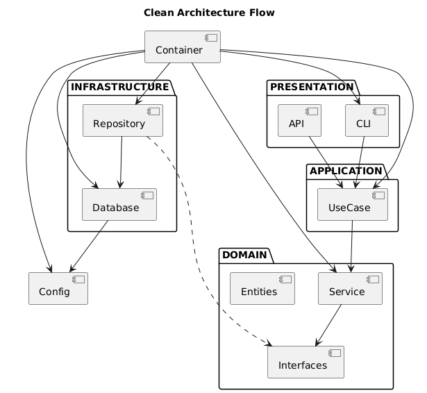

# Display Program Management System - Clean Architecture

## 🎯 Tổng quan dự án

**Display Program Management System** là hệ thống quản lý chương trình trưng bày sản phẩm được xây dựng theo **Clean Architecture**. Hệ thống giúp đánh giá khách hàng có đủ điều kiện nhận thưởng dựa trên các tiêu chí trưng bày sản phẩm.

## 📚 Hướng dẫn cho người mới học Clean Architecture

### Clean Architecture là gì?

Clean Architecture là một kiến trúc phần mềm được thiết kế bởi **Robert C. Martin (Uncle Bob)**. Mục tiêu chính là tạo ra code:
- ✅ **Dễ test** - Có thể test từng phần riêng biệt
- ✅ **Dễ bảo trì** - Dễ đọc, hiểu và sửa đổi
- ✅ **Linh hoạt** - Dễ dàng thay đổi implementation
- ✅ **Mở rộng** - Dễ dàng thêm tính năng mới

### Tại sao cần Clean Architecture?

#### 1. **Separation of Concerns (Tách biệt mối quan tâm)**
- Mỗi layer có trách nhiệm riêng biệt
- Dễ hiểu và debug
- Dễ thay đổi một phần mà không ảnh hưởng phần khác

#### 2. **Dependency Inversion (Đảo ngược phụ thuộc)**
- High-level modules không phụ thuộc vào low-level modules
- Cả hai đều phụ thuộc vào abstractions (interfaces)
- Dễ dàng thay đổi implementation

#### 3. **Testability (Khả năng test)**
- Domain logic có thể test độc lập
- Infrastructure có thể mock
- Dễ dàng viết unit tests

#### 4. **Maintainability (Khả năng bảo trì)**
- Code dễ đọc và hiểu
- Dễ thêm tính năng mới
- Dễ sửa lỗi

## 🏗️ Cấu trúc Clean Architecture

```
src/
├── domain/                    # Domain Layer - Business Logic
│   ├── entities/             # Core Business Objects
│   │   ├── customer.py       # Customer Entity
│   │   ├── program.py        # Program & RegisterItem Entities
│   │   ├── evaluation.py     # Evaluation Entities
│   │   └── registration.py   # Registration Entity
│   ├── repositories/         # Repository Interfaces
│   │   ├── customer_repository.py
│   │   ├── program_repository.py
│   │   ├── evaluation_repository.py
│   │   └── registration_repository.py
│   └── services/             # Domain Services
│       └── evaluation_service.py
├── application/              # Application Layer - Use Cases
│   ├── use_cases/           # Use Cases
│   │   └── evaluate_customer_use_case.py
│   └── dtos/                # Data Transfer Objects
├── infrastructure/          # Infrastructure Layer - External Dependencies
│   ├── database/            # Database Implementation
│   │   └── sql_server_connection.py
│   └── repositories/        # Repository Implementations
├── presentation/            # Presentation Layer - User Interface
│   ├── cli/                 # Command Line Interface
│   │   └── evaluation_cli.py
│   └── api/                 # REST API (Future)
├── config/                  # Configuration
│   └── settings.py
├── tests/                   # Test Suite
│   ├── unit/                # Unit Tests
│   ├── integration/         # Integration Tests
│   ├── test_clean_architecture.py
│   └── demo_clean_architecture.py
└── main.py                  # Dependency Injection Container
```

## 🎯 Các Layer trong Clean Architecture

### 1. **Domain Layer (Lớp nghiệp vụ)**
- **Entities**: Các đối tượng nghiệp vụ cốt lõi
- **Repositories**: Interfaces cho data access
- **Services**: Business logic phức tạp
- **Không phụ thuộc** vào bất kỳ layer nào khác

### 2. **Application Layer (Lớp ứng dụng)**
- **Use Cases**: Các business operations cụ thể
- **DTOs**: Data transfer objects
- **Orchestration**: Điều phối domain services
- **Phụ thuộc** vào Domain Layer

### 3. **Infrastructure Layer (Lớp hạ tầng)**
- **Database**: Kết nối và truy cập database
- **External APIs**: Gọi các API bên ngoài
- **File Systems**: Đọc/ghi file
- **Implement** các interfaces từ Domain Layer

### 4. **Presentation Layer (Lớp giao diện)**
- **CLI**: Command line interface
- **Web UI**: Giao diện web
- **REST API**: API endpoints
- **Sử dụng** Use Cases từ Application Layer

## 🚀 Cách sử dụng

### 1. **Chạy Demo (Khuyến nghị cho người mới)**
```bash
# Chạy demo toàn diện với giải thích chi tiết
py src/tests/demo_clean_architecture.py
```

### 2. **Chạy Tests**
```bash
# Chạy tất cả tests
py src/tests/test_clean_architecture.py

# Chạy tests với pytest (nếu có)
py -m pytest src/tests/
```

### 3. **Chạy Ứng dụng**
```bash
# Chạy ứng dụng chính
py src/main.py
```

## 📋 Yêu cầu hệ thống

- **Python**: 3.8+
- **Database**: SQL Server
- **Dependencies**: pyodbc

### Cài đặt dependencies
```bash
pip install pyodbc
```

## 🔧 Cấu hình

### Database Configuration
```python
# src/config/settings.py
DATABASE_SETTINGS = {
    "server": "xxxx",
    "database": "xxx", 
    "username": "xxx",
    "password": "xxxx"
}
```

### Environment Variables
```bash
# Có thể override bằng environment variables
export DB_SERVER=your_server
export DB_DATABASE=your_database
export DB_USERNAME=your_username
export DB_PASSWORD=your_password
```

## 📚 Học Clean Architecture

### 1. **Bắt đầu với Demo**
```bash
# Chạy demo để hiểu cấu trúc
py src/tests/demo_clean_architecture.py
```

### 2. **Đọc Code**
- Bắt đầu từ `src/domain/entities/` - Hiểu business objects
- Tiếp tục với `src/domain/services/` - Hiểu business logic
- Xem `src/application/use_cases/` - Hiểu use cases
- Kiểm tra `src/infrastructure/` - Hiểu external dependencies

### 3. **Thực hành**
- Thêm entity mới
- Tạo use case mới
- Viết tests
- Thêm tính năng mới

### 4. **Tài liệu tham khảo**
- [Clean Architecture by Robert C. Martin](https://blog.cleancoder.com/uncle-bob/2012/08/13/the-clean-architecture.html)
- [Python Clean Architecture Example](https://github.com/cosmic-python/code)
- [Dependency Injection in Python](https://python-dependency-injector.ets-labs.org/)

## 🧪 Testing

### Unit Tests
```bash
# Chạy unit tests
py src/tests/test_clean_architecture.py
```

### Test Structure
- **Domain Tests**: Test business logic
- **Application Tests**: Test use cases
- **Integration Tests**: Test cross-layer integration
- **End-to-End Tests**: Test complete workflows

## 🔄 Development Workflow

### 1. **Thêm Entity mới**
1. Tạo entity trong `src/domain/entities/`
2. Thêm business logic
3. Viết tests
4. Update repository interface

### 2. **Thêm Use Case mới**
1. Tạo use case trong `src/application/use_cases/`
2. Inject dependencies
3. Viết tests
4. Update presentation layer

### 3. **Thêm Infrastructure mới**
1. Implement repository interface
2. Tạo database connection
3. Viết tests
4. Update dependency injection

## 🎯 Best Practices

### 1. **Dependency Rule**
- Dependencies chỉ được trỏ vào trong (inner layers)
- Domain layer không phụ thuộc vào bất kỳ layer nào

### 2. **Interface Segregation**
- Sử dụng interfaces thay vì concrete classes
- Mỗi interface chỉ chứa methods cần thiết

### 3. **Single Responsibility**
- Mỗi class chỉ có một lý do để thay đổi
- Tách biệt concerns rõ ràng

### 4. **Open/Closed Principle**
- Mở cho extension, đóng cho modification
- Sử dụng interfaces và inheritance

## 🐛 Troubleshooting

### Common Issues

#### 1. **Import Errors**
```bash
# Đảm bảo đang chạy từ root directory
cd E:\Other\demo
py src/tests/demo_clean_architecture.py
```

#### 2. **Database Connection Errors**
```bash
# Kiểm tra database connection
py -c "from src.infrastructure.database.sql_server_connection import SqlServerConnection; print(SqlServerConnection().test_connection())"
```

#### 3. **Module Not Found**
```bash
# Kiểm tra Python path
py -c "import sys; print(sys.path)"
```

## 📞 Hỗ trợ

Nếu bạn gặp vấn đề hoặc có câu hỏi:

1. **Chạy demo** để hiểu cấu trúc
2. **Đọc code** trong từng layer
3. **Chạy tests** để kiểm tra
4. **Tạo issue** nếu cần hỗ trợ

## 🎉 Kết luận

Clean Architecture giúp bạn:
- ✅ Viết code dễ test và bảo trì
- ✅ Tách biệt business logic khỏi technical concerns
- ✅ Dễ dàng thay đổi implementation
- ✅ Phù hợp cho team development

**Hãy bắt đầu với demo để hiểu rõ hơn về Clean Architecture!** 🚀

